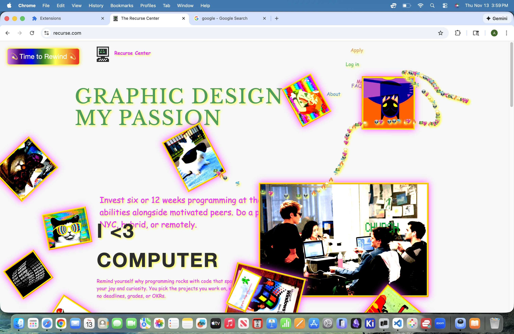

# 🌈💖 Graphic Design is My Passion!

## Description

Channel your inner artist with this gloriously chaotic **Chrome browswer extension**! Inspired by the high-energy excitement of messy frontend from the early 2000s, this extension guarantees a healthy dose of laughter and whimsy with each webpage you visit. 

This toy project was made during **Terrible Ideas Day at [the Recurse Center](https://www.recurse.com)**, in the span of just a couple hours. I organized the event in the hopes of encouraging the community to release the pressure of perfection, dive into the joys of playful programming, and work at the edge of their abilities—**building purely for fun**. 

So many fantastic creations came out of Terrible Ideas Day (including a few other browser extensions!), and I sincerely hope that this mindset of silly experimentation continues to inspire folks at RC and beyond! 


## Examples

🧑‍💻 Recurse Center homepage   |   🪩 My personal website 
:-------------------------:|:-------------------------:
 | 


## Features

- High-contrast visual styling
- Playful images and energetic gifs
- Randomized headings with fun messages
- Zesty emoji trail following mouse movement
- Text evasion when cursor approaches
- Dizzying rotation on spin button click


## Tools / Tech

- **TypeScript**: webpage modification logic
    - DOM manipulation
    - element injection
    - event listeners
    - extension behavior
- **CSS**: styling and animations
- **JSON**: packaging and configs to build extension
    - `tsconfig.json` for compiling TypeScript to JavaScript
    - `manifest.json` for outlining extension rules
    - `package.json` for dev env / setup / dependencies


## Getting Started

*Note that the steps below assume Node.js (+ npm) is already installed*

### Assembling materials:

**Clone** the repo:
```
git clone https://github.com/aadriien/graphic-design-is-my-passion.git

# Navigate to directory
cd graphic-design-is-my-passion
```

Install **dependencies**:
```
npm install
```

**Build** the extension:
```
npm run build
```

### Activating in browser:

1. Open `chrome://extensions/`
2. Enable `Developer mode` (toggle)
3. Click `Load unpacked`
4. Select `dist/` folder


